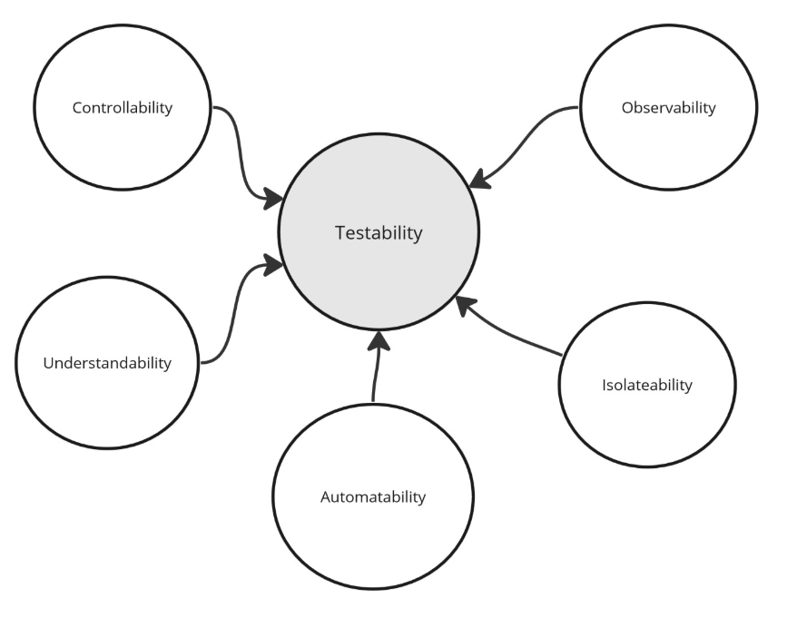
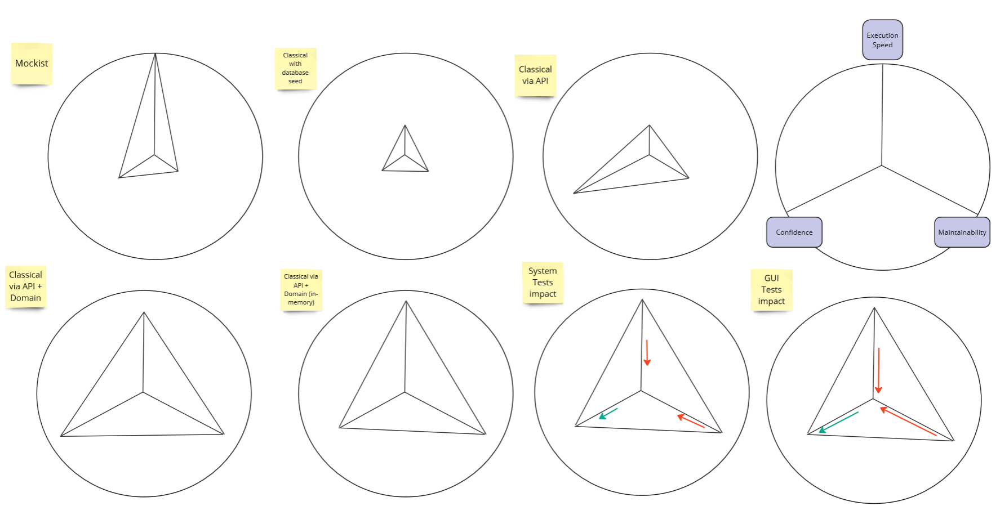

# Testing

## Key Terms:
* observability
* controlability
* isolateability
* automatability
* understandability

## Types
* state-based tests
* interaction tests

## Strategy 
* expression
$GIVEN \dots WHEN \dots THEN \dots$
* evaluation criteria
  * `confidence` provided by tests
  * `speed`
  * `maintainability`
* artifacts
* `stub` -> allow dependency isolation, but are not themselves subjects of verification (present in GIVEN, but not in THEN)
* `mock` -> allow dependency isolation and are themselves subjects of verification (present in GIVEN and in THEN)

## Practical
* striking balance between unit tests (domain-driven, high speed, low confidence) and integration tests (test cases and dependencies, low speed, high confidence)
* system tests are low speed, low maintainability, high confidence
* GUI tests are low speed, low maintainability, high confidence

# References
* [automated tests why](https://kamilgrzybek.com/blog/posts/automated-tests-the-why)
* [automated tests testability](https://kamilgrzybek.com/blog/posts/automated-tests-testability)
* [automated tests strategy](https://kamilgrzybek.com/blog/posts/automated-tests-strategy)
